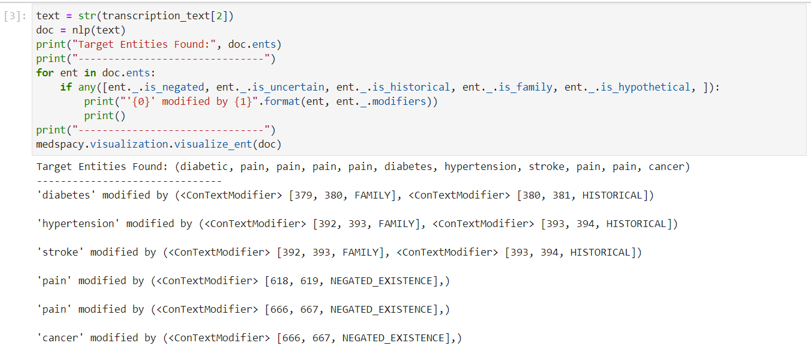
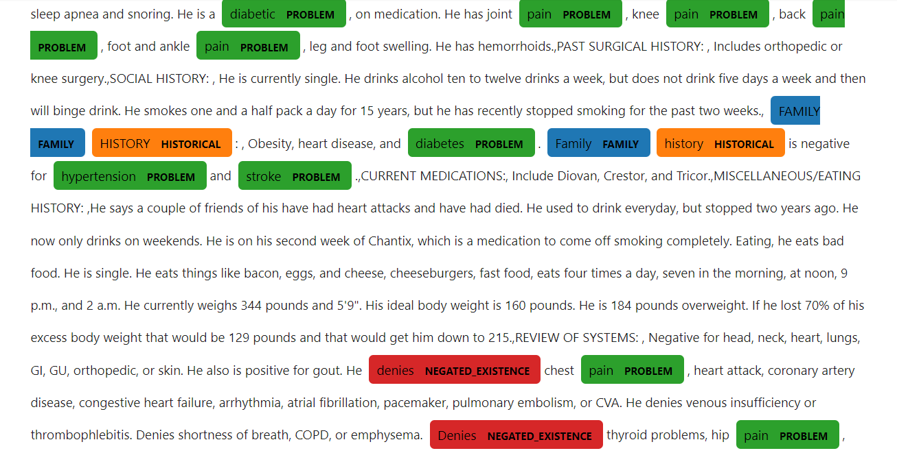
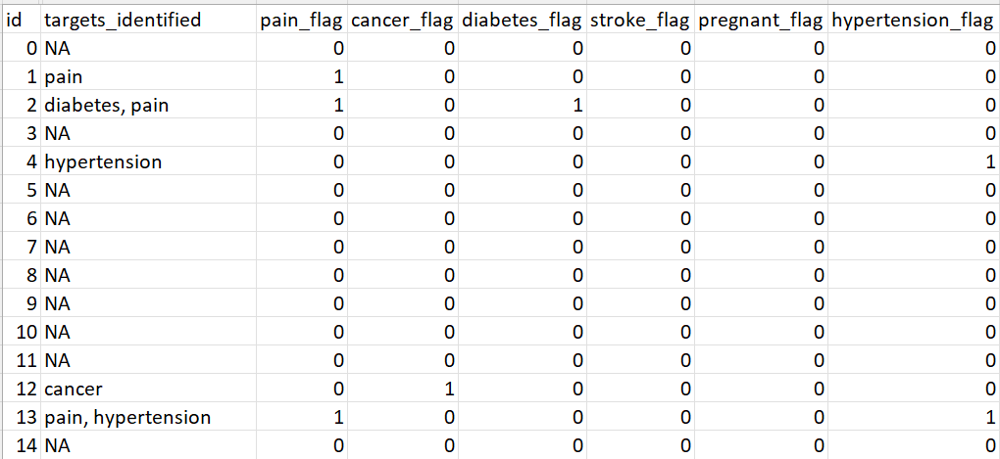
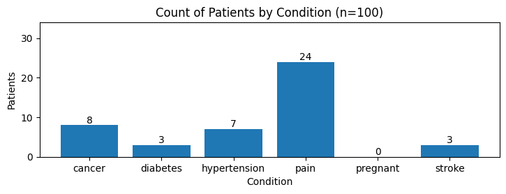
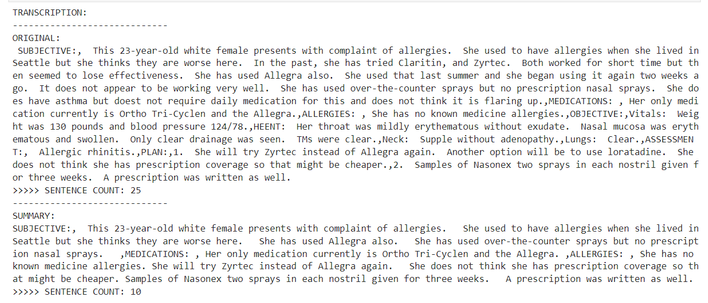

# Clinical Note NLP   
- Description: Natural Language Processing on Clinical Notes with SpaCy
- Created: 5/3/23  

## Overview:
- This code performs natural language processing (NLP) on a dataset of transcribed clinical notes.   
- Two types of NLP are performed: Named Entity Recognition (NEM) and Summarization
    - NEM extracts concepts from the notes using keywords. The MedSpaCy library includes a NEM pipeline to identify target medical conditions and medications. This process can quickly identify and flag patients with specific conditions for analysis.
    - Summarization breaks longer text down into key sentences and information. Through lemmatization, words are grouped into their lemma or dictionary form, which are then tallied. Each sentence is scored based on presence of the most frequent lemmas or key concepts.
- The NLP library used in this code is SpaCy, with a related library, MedSpaCy:    
    - <a href="https://spacy.io/" target="_blank">SpaCy</a> is an open-sourced Python library of NLP tools 
    - <a href="https://github.com/medspacy/medspacy" target="_blank">MedSpaCy</a> is a library of NLP tools using the SpaCy framework in combination with other packages to perform NLP specific to the clinical domain

## Files:
- Jupyter Notebook: [clinical_note_nlp.ipynb](clinical_note_nlp.ipynb)
- Input File: [input-mtsamples.csv](input-mtsamples.csv) sourced from [kaggle](https://www.kaggle.com/datasets/tboyle10/medicaltranscriptions)
- Output Files: 
    1. [output-with-targets.csv](output-with-targets.csv)
    2. [output-with-summary.csv](output-with-summary.csv)

## Setup
Required Libraries:
- spacy, medspacy, pandas, matplotlib, collections 

Install SpaCy Model: 
- python -m spacy download en_core_web_sm

Documentation: 
- SpaCy: https://spacy.io/
- MedSpaCy: https://github.com/medspacy/medspacy

## Process:
1. Read the source file into a dataframe
2. Limit the dataframe to 100 rows of data
3. Create a dictionary of the clinical note transcriptions 
4. Extract concepts from transcribed notes using MedSpaCy Named Entity Recognition 
    1. Load the model
    2. Specify target conditions, diseases, medications, or treatments for identification
    3. Perform NEM on a single patient's notes 
        - identify target keywords, and print them to the screen  
    4. Perform NEM on a list of patient notes 
        - identify target keywords in each record and add them to a list
        - add the targets back to the patient's record in the dataframe
        - create columns to identify conditions using one-hot encoding
        - save the dataframe to an output file
    5. Create a chart to analyze the total patients with each condition extracted from the text 
5. Create an abstract summary of the full transcription on a single patient's notes
    1. Load the model
    2. Remove spaces, punctuation, and stop words from the text
    3. Count lemma frequency and identify top 5 lemmas
    4. Count lemmas and calculate a score for each sentence
    5. Create a histogram to visualize sentence score frequency
    6. Set a cutpoint score based on histogram
    7. Re-run steps 3 and 4, then add sentences with scores above the cutpoint to a new summary list 
    8. Display the final summary
6. Create an abstract summary of the full transcription on a list of patient notes
    1. Load the model
    2. Remove spaces, punctuation, and stop words from the text
    3. Count lemma frequency and identify top 5 lemmas
    4. Count lemmas and calculate a score for each sentence
    5. Set a cutpoint score 
    6. Re-run steps 3 and 4, then add sentences with scores above the cutpoint to a new summary list
    7. Add the summary back to the patient's record in the dataframe, and save the dataframe to an output file

## Screenshots 

### NEM Example  

### NEM Visualization  

### Conditions Identified & Saved to File

### Conditions Chart

### Summarization Example

   
   
   
   
   
      

